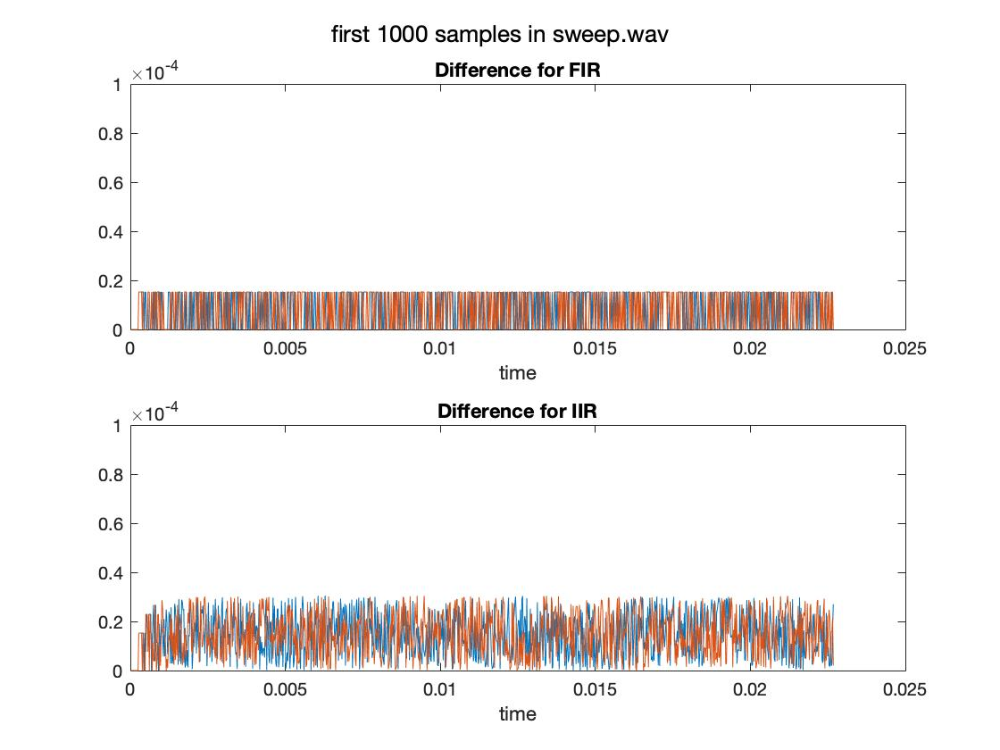
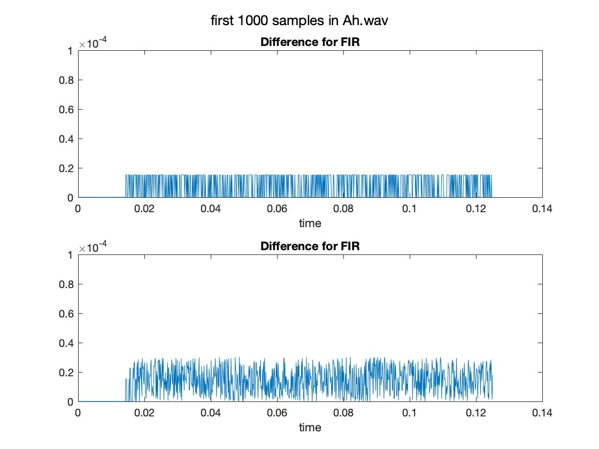

# Assignment 1: CombFilter implementation

1. [10] Design your interface and code structure

    * __CCombFilterIf__ has a pointer member which points to the __CCombFilterBase__ instance (see CombFilterIf.h).
    * __CCombFilterFIR__ and __CCombFilterIIR__ are the two classes derived from __CCombFilterBase__ (see CombFilter.h).

2. [20] Implement an FIR comb filter

3. [20] Implement an IIR comb filter

4. [15] Modify the main function

5. [5] Real-world example
Process two short audio files of your choice and verify your results by running the effect in Matlab and computing the difference between outputs. Add the plots to a new file assignment1.md in your repository

    * wav/sweep.wav: __-i "sweep.wav" -o "sweep_fir.wav" -t FIR -g 0.5 -d 0.0002268__
    
    * wav/Ah.wav: __-i "Ah.wav" -o "Ah_fir.wav" -t FIR -g 0.5 -d 0.00125__
    
       
    
6. [30] Add tests to your main function
If your main is called without command line arguments, automatically run tests verifying your implementation. Implement the following test (a function each):
    1. FIR: Output is zero if input freq matches feedforward     
    __testFIR()__
    2. IIR: amount of magnitude increase/decrease if input freq matches feedback    
    __testIIR()__
    3. FIR/IIR: correct result for VARYING input block size    
    __testBlock()__
    4.  FIR/IIR: correct processing for zero input signal      
    __testZeros()__
    5. One more additional MEANINGFUL test: __test with delay equal to zero__       
    __testZeroDelay()__
