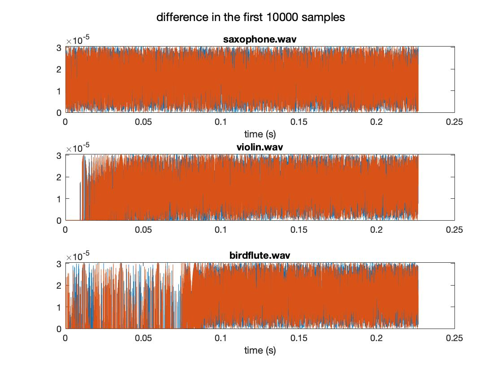

# Assignment 2: Vibrato

0. [10] Implement the Ringbuffer as specified in exercise 2: ringbuffer but move your tests to the unittest framework (see below).
* I am using the provided ringbuffer class in branch ass2_stub...

1. [15] This time, please design the class interface from scratch in src/inc/Vibrato.h. Try to design a user-friendly interface (e.g., use seconds and Hz instead of samples where appropriate). Also, at the top of the code, provide a comment block with a brief explanation about your design choices.
* Please check Vibrato.h

2. [15] Implement src/Vibrato/Vibrato.cpp using a test-driven approach. Write simple unit tests (e.g., setParam with various values) in src/Tests/Tests/Test_Vibrato.cpp as you develop.
* Please check Vibrato.cpp

3. [15] Vibrato requires an LFO and fractional delay (which you already have in the ringbuffer). Design and implement a wavetable LFO class in src/inc/Lfo.h. A float-only sinusoidal LFO is good enough.
* Please check Lfo.h

4. [25] Write these validation / verification tests in Test_Vibrato.cpp:

* Ringbuffer tests as specified in exercise 2.
* Output equals delayed input when modulation amplitude is 0.
* DC input stays DC ouput regardless of parametrization.
* Varying input block size.
* Zero input signal.
* __Output equals delayed input when modulation frequency is 0.__ (too trivial?)
* Specify the SUITE name to run the corresponding tests: __RingBuffer__ or __Vibrato__

5. [10] Finally, test several audio files by processing them through MUSI6106Exec.cpp and compare the result to the MATLAB-processed version.
* audio files in wav/
* matlab script and figure in fig/
* cmd example: __-i "input.wav" -o "output.wav" -d 0.00023 -w 0.00023 -f 21__

